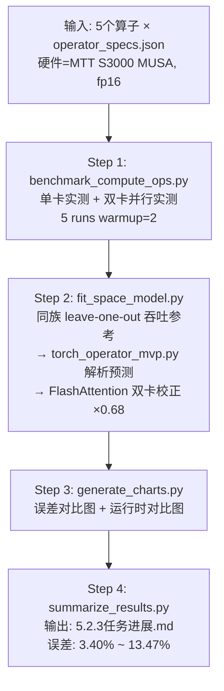
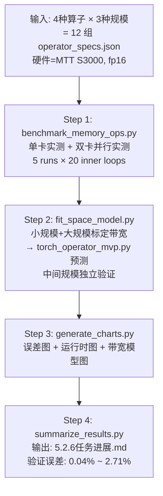
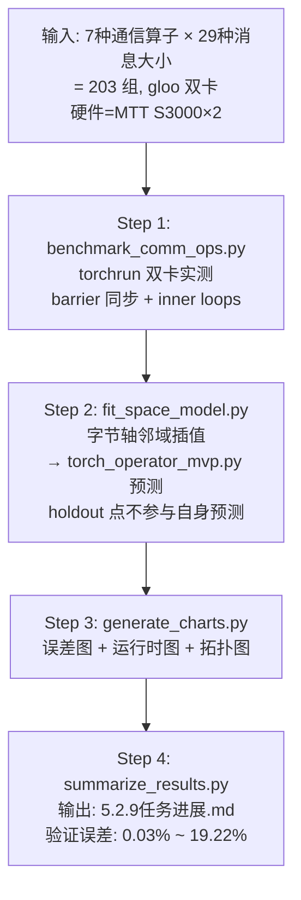

# LLama3.1-8B 算子级空间维度建模 — 演示指南（摩尔线程版）

## 一、演示目标

向软件测评方证明：**输入 LLama3.1-8B 训练/推理相关的单个算子描述与硬件配置，触发算子级空间维度建模，获取预测执行时间**，可正常完成建模流程，无报错无中断，**输出预测时间与实际执行时间相对误差 ≤ 20%**。

需要演示的三类算子：

| # | 算子类型 | 代表算子 | 所属模型层 |
|---|---------|---------|-----------|
| 1 | **计算密集型** | `mlp_up_gemm`、`flash_attention` | MLP 层 GEMM 矩阵乘法、Attention 层 |
| 2 | **访存密集型** | `data_copy`、`concat`、`reshape_transpose`、`slice_copy` | 数据搬运、张量拼接、转置、切片 |
| 3 | **通信密集型** | `all_reduce`、`all_gather`、`reduce_scatter`、`broadcast`、`reduce`、`all_to_all`、`send_recv` | TP 并行通信集合操作 |

---

## 二、核心概念：「算子级空间维度建模」

### 2.1 「空间维度」的含义

「空间维度建模」是指：针对不同的**算子类型**和**硬件执行空间**（单卡计算空间、显存带宽空间、多卡通信空间），分别构建性能预测模型。不同空间下的建模策略不同：

| 空间 | 建模对象 | 建模方法 | 硬件约束 |
|------|---------|---------|---------| 
| **计算空间** | GEMM、FlashAttention 等 FLOPs 密集算子 | 同族 leave-one-out 吞吐参考 + 解析预测 | GPU 算力（TFLOPS） |
| **访存空间** | data_copy、concat 等 Memory-bound 算子 | 带宽标定（小/大规模标定点）+ 解析预测 | 显存带宽（GB/s） |
| **通信空间** | AllReduce、AllGather 等集合通信算子 | 字节轴邻域插值（calibration → validation） | PCIe/gloo 互联带宽 |

### 2.2 空间维度参数选项

空间维度通过以下命令行参数组合控制：

| 空间配置 | `--parallel-mode` | `--tp-size` | `--world-size` | `--nnodes` | 启动方式 | 通信类型 |
|---------|-------------------|-------------|---------------|-----------|---------|---------|
| ① 单卡 | `single` | 1 | 1 | 1 | `python` 直接运行 | 无通信 |
| ② 单机 TP2 | `tp` | 2 | 2 | 1 | `torchrun --standalone --nproc_per_node 2` | NVLink/PCIe AllReduce |
| ③ 跨机 TP2 | `tp` | 2 | 2 | 2 | 两台机器各运行 `torchrun --nnodes 2 --node_rank 0/1` | 以太网/InfiniBand AllReduce |

> [!NOTE]
> **空间建模**：系统支持三种并行部署拓扑的推理性能建模——**单卡**（无通信开销）、**单机 TP2**（NVLink/PCIe 卡间 AllReduce）、**跨机 TP2**（以太网跨节点通信）。不同空间配置下，计算图的 TP 分片（`tp_shard_node_estimate`）和集合通信开销（`build_predicted_comm`）的建模策略各不相同。
> **时间建模**：在给定空间并行配置下，推理分为 prefill 和 decode 两个时间阶段。系统通过计算图逐节点分析 + 模块级 profile 替换 + 运行时开销校正，输出每阶段和整体请求的预测执行时间。

> [!TIP]
> **扩展规划**：空间维度后续将扩充更多并行方式，如 PP（流水线并行）、TP+PP 混合并行等，以覆盖更丰富的分布式推理部署场景。

### 2.3 建模四步管线

本项目的每类算子均遵循统一的四步管线：


| 步骤 | 说明 | 输出 |
|------|------|------|
| **Benchmark** | 在 MUSA GPU 上运行多组尺寸的算子，实测执行时间 | `benchmark_results.json` |
| **Fit** | 调用 `torch_operator_mvp.py` 解析预测，拟合空间模型 | `space_model_results.json` |
| **Chart** | 生成误差对比图和运行时对比图 | `charts/error_compare.png`、`charts/runtime_compare.png` |
| **Summarize** | 汇总所有结果为人类可读的 Markdown 报告 | `5.2.x任务进展.md` |

### 2.4 与 LLama3.1-8B 的关系

所有算子参数均对应 LLama3.1-8B 的模型架构：

| 模型参数 | 值 | 影响的算子 |
|---------|-----|-----------| 
| `hidden_size` | 4096 | MLP GEMM 的 K 维度、Memory 算子的 H 维度 |
| `intermediate_size` | 14336 | `mlp_up_gemm`/`mlp_gate_gemm` 的 N 维度 |
| `num_attention_heads` | 32 | `flash_attention` 的 heads 数量 |
| `head_dim` | 128 | `flash_attention` 的 head_dim |
| `num_layers` | 32 | 每层都包含上述所有算子 |

---

## 三、环境准备

**硬件要求**：

| 算子类型 | GPU 数量 | 硬件 |
|---------|---------|------|
| 计算密集型 | 双卡（单卡+双卡并行测试） | 摩尔线程 MTT S3000 × 2 |
| 访存密集型 | 双卡（单卡+双卡并行测试） | 摩尔线程 MTT S3000 × 2 |
| 通信密集型 | 双卡 | 摩尔线程 MTT S3000 × 2 |

**设备后端**：MUSA（`torch_musa`）

**通信后端**：gloo（当前 MTT S3000 环境下 MCCL 不可用，采用 `gloo + CPU staging` 替代路径）

---

## 四、演示一：计算密集型算子（Compute-intensive）

### 4.1 算子说明

计算密集型算子对应 LLama3.1-8B 中以 FLOPs 为主导的算子，包括 MLP 层的 GEMM 矩阵乘法和 Attention 层的 FlashAttention：

| 算子 | 对应模型层 | 运算 | FLOPs 公式 |
|------|-----------|------|-----------| 
| `mlp_up_gemm` | MLP 上投影 | [1024, 4096] × [4096, 14336] | 2 × 1024 × 4096 × 14336 |
| `mlp_gate_gemm` | MLP 门控投影 | [1024, 4096] × [4096, 14336] | 2 × 1024 × 4096 × 14336 |
| `mlp_down_gemm` | MLP 下投影 | [1024, 14336] × [14336, 4096] | 2 × 1024 × 14336 × 4096 |
| `attention_output_proj_gemm` | Attention 输出投影 | [1024, 4096] × [4096, 4096] | 2 × 1024 × 4096 × 4096 |
| `flash_attention` | Self-Attention | Q×K^T→Softmax→×V | 4 × 1 × 32 × 1024² × 128 |

> [!NOTE]
> 配置来源：[operator_specs.json](file:///home/o_mabin/moer-proj/projects/operators/compute/operator_specs.json)，所有 GEMM 的 M=1024 固定对应 seq_len=1024。

### 4.2 空间建模方法

| 参数 | 值 | 说明 |
|------|-----|------|
| 建模方法 | 同族 leave-one-out 吞吐参考 | GEMM 族：排除自身后用同族均值 TFLOPS；FlashAttention：用额外 seq=512 标定点 |
| 预测工具 | `torch_operator_mvp.py` | 主分析工具的独立算子级预测入口 |
| 后校正 | FlashAttention 双卡：`T_sim = 0.68 × T_tool_raw` | 当前 `mp 2.1` 环境 FlashAttention 兼容路径校正 |
| 数据类型 | `fp16` | 半精度 |
| 测试规模 | 单卡 + 单机双卡 | 每个算子同时测试两种并行规模 |

### 4.3 执行建模命令

**一键执行全部 5 个计算密集型算子**：

```bash
cd /home/o_mabin/moer-proj && bash scripts/run_operator_compute_moorethreads.sh
```

**只测某个算子**（例如只测 `mlp_up_gemm`）：

```bash
cd /home/o_mabin/moer-proj/projects/operators/compute && \
cp operator_specs.json operator_specs.json.bak && \
python3 -c "import json; specs=json.load(open('operator_specs.json')); json.dump([s for s in specs if s['id']=='mlp_up_gemm'], open('operator_specs.json','w'), indent=2); print('OK')" && \
bash run_523_suite.sh ; \
mv operator_specs.json.bak operator_specs.json
```

> [!TIP]
> 把 `mlp_up_gemm` 替换为任意算子 ID 即可。可用 ID：`mlp_up_gemm`、`mlp_gate_gemm`、`mlp_down_gemm`、`flash_attention`、`attention_output_proj_gemm`

该脚本执行流程：
1. 加载 [_run_common.sh](file:///home/o_mabin/moer-proj/scripts/_run_common.sh)，设置 MUSA 环境
2. 创建运行目录 `results/operator-compute/<timestamp>/`
3. 调用 [run_523_suite.sh](file:///home/o_mabin/moer-proj/projects/operators/compute/run_523_suite.sh)，依次执行：

```bash
python3 benchmark_compute_ops.py    # Step 1: 实测
python3 fit_space_model.py          # Step 2: 解析预测 + 拟合
python3 generate_charts.py          # Step 3: 生成图表
python3 summarize_results.py        # Step 4: 汇总报告
```

### 4.4 查看输出结果

**方式一：看汇总报告（推荐，最直观）**：

```bash
cat /home/o_mabin/moer-proj/projects/operators/compute/5.2.3任务进展.md
```

**方式二：看 JSON 模型结果**：

```bash
cat $(ls -td /home/o_mabin/moer-proj/results/operator-compute/*/artifacts/ | head -1)/space_model_results.json | python3 -m json.tool
```

**方式三：一行提取误差**：

```bash
python3 -c "
import json, glob
f = sorted(glob.glob('/home/o_mabin/moer-proj/results/operator-compute/*/artifacts/space_model_results.json'))[-1]
d = json.load(open(f))
print('通过:', d['all_within_20_percent'])
for op in d['operators']:
    print(f'  {op[\"id\"]}: 单卡={op[\"single_card\"][\"error_percent\"]:.2f}%  双卡={op[\"dual_card\"][\"error_percent\"]:.2f}%')
"

### 4.5 已有验证数据

来源：[5.2.3任务进展.md](file:///home/o_mabin/moer-proj/projects/operators/compute/5.2.3任务进展.md)

**设备**：MTT S3000 × 2，MUSA 后端

| 算子 | 单卡 T_real(ms) | 单卡 T_sim(ms) | 单卡误差 | 双卡 T_real(ms) | 双卡 T_sim(ms) | 双卡误差 |
|------|----------------|----------------|---------|----------------|----------------|---------|
| `mlp_up_gemm` | 296.620 | 316.878 | **6.83%** | 153.322 | 163.365 | **6.55%** |
| `mlp_gate_gemm` | 303.881 | 314.204 | **3.40%** | 153.851 | 163.166 | **6.05%** |
| `mlp_down_gemm` | 320.847 | 308.580 | **3.82%** | 166.714 | 158.833 | **4.73%** |
| `flash_attention` | 11.723 | 13.302 | **13.47%** | 3.339 | 3.179 | **4.78%** |
| `attention_output_proj_gemm` | 93.375 | 87.653 | **6.13%** | 48.709 | 45.065 | **7.48%** |

> [!IMPORTANT]
> **全部 5 个计算密集型算子在单卡和双卡下的预测误差均 ≤ 13.47%，低于 20% 的验收要求。判定结果：通过。**

---

## 五、演示二：访存密集型算子（Memory-intensive）

### 5.1 算子说明

访存密集型算子对应 LLama3.1-8B 中以显存带宽为瓶颈的算子：

| 算子 | 对应操作 | 张量形状 | 来源模型层 |
|------|---------|---------|-----------|
| `concat` | 张量拼接（KV cache 拼接等） | [16/32/64, 1024, 128] × 2 | `attention.head_concat` |
| `data_copy` | 显存数据搬运 | [8/16/32, 1024, 4096] | `residual.hidden_state_copy` |
| `reshape_transpose` | 多头注意力张量重排 | [8/16/32, 1024, 4096] | `attention.qkv_reshape_transpose` |
| `slice_copy` | KV cache 切片拷贝 | [32, 16/32/64, 1024, 128] | `attention.kv_cache_slice` |

> [!NOTE]
> 每种算子有 3 种规模（小/中/大），配置来源：[operator_specs.json](file:///home/o_mabin/moer-proj/projects/operators/memory/operator_specs.json)

### 5.2 空间建模方法

| 参数 | 值 | 说明 |
|------|-----|------|
| 建模方法 | 带宽标定（小规模+大规模标定）→ 中间规模验证 | 同类算子两端规模点构造 `memory_bandwidth_gbps + alpha_ms` 标定 |
| 预测工具 | `torch_operator_mvp.py` | 主分析工具的独立算子级预测入口 |
| 数据类型 | `fp16` | 半精度 |
| 测试规模 | 单卡 + 单机双卡 | 双卡模式下 shape 维度折半 |

### 5.3 执行建模命令

**一键执行全部 4 类访存算子（各 3 种规模 = 12 组）**：

```bash
cd /home/o_mabin/moer-proj && bash scripts/run_operator_mem_moorethreads.sh
```

**只测某类算子**（例如只测 `data_copy`）：

```bash
cd /home/o_mabin/moer-proj/projects/operators/memory && \
cp operator_specs.json operator_specs.json.bak && \
python3 -c "import json; specs=json.load(open('operator_specs.json')); json.dump([s for s in specs if s['name']=='data_copy'], open('operator_specs.json','w'), indent=2); print('OK')" && \
bash run_526_suite.sh ; \
mv operator_specs.json.bak operator_specs.json
```

> [!TIP]
> 把 `data_copy` 替换为：`concat`、`data_copy`、`reshape_transpose`、`slice_copy` 均可。

该脚本调用 [run_526_suite.sh](file:///home/o_mabin/moer-proj/projects/operators/memory/run_526_suite.sh)，执行：

```bash
python3 benchmark_memory_ops.py    # Step 1: 实测（5 runs × 20 inner loops）
python3 fit_space_model.py          # Step 2: 解析预测 + 带宽模型拟合
python3 generate_charts.py          # Step 3: 生成图表
python3 summarize_results.py        # Step 4: 汇总报告
```

### 5.4 查看输出结果

**方式一：看汇总报告（推荐）**：

```bash
cat /home/o_mabin/moer-proj/projects/operators/memory/5.2.6任务进展.md
```

**方式二：一行提取误差**：

```bash
python3 -c "
import json, glob
f = sorted(glob.glob('/home/o_mabin/moer-proj/results/operator-memory/*/artifacts/space_model_results.json'))[-1]
d = json.load(open(f))
print('通过:', d['all_within_20_percent'])
for op in d['operators']:
    if op['point_role'] == 'validation':
        print(f'  {op[\"id\"]}: 单卡={op[\"single_card\"][\"error_percent\"]:.2f}%  双卡={op[\"dual_card\"][\"error_percent\"]:.2f}%')
"

### 5.5 已有验证数据

来源：[5.2.6任务进展.md](file:///home/o_mabin/moer-proj/projects/operators/memory/5.2.6任务进展.md)

**设备**：MTT S3000 × 2，MUSA 后端；单卡平均带宽 252.94 GB/s，双卡平均带宽 509.43 GB/s

**验证点（中间规模，不含标定点）**：

| 算子 | 点类型 | 单卡 T_real(ms) | 单卡 T_sim(ms) | 单卡误差 | 双卡 T_real(ms) | 双卡 T_sim(ms) | 双卡误差 |
|------|-------|----------------|----------------|---------|----------------|----------------|---------|
| `concat_16mb` | validation | 0.105 | 0.106 | **1.15%** | 0.063 | 0.065 | **2.71%** |
| `data_copy_128mb` | validation | 0.670 | 0.671 | **0.09%** | 0.345 | 0.344 | **0.08%** |
| `reshape_transpose_128mb` | validation | 0.696 | 0.702 | **0.83%** | 0.360 | 0.361 | **0.38%** |
| `slice_copy_256mb` | validation | 0.680 | 0.680 | **0.04%** | 0.351 | 0.350 | **0.17%** |

> [!IMPORTANT]
> **全部 4 个访存密集型算子的最大验证误差 ≤ 2.71%，远低于 20% 的要求。判定结果：通过。**

---

## 六、演示三：通信密集型算子（Communication-intensive）

### 6.1 算子说明

通信密集型算子对应 LLama3.1-8B 多卡并行训练/推理中的集合通信操作：

| 算子 | 对应操作 | 使用场景 |
|------|---------|---------| 
| `all_reduce` | 梯度全归约 | TP 并行 backward 梯度同步 |
| `all_gather` | 权重全收集 | TP 并行 forward 参数聚合 |
| `reduce_scatter` | 归约散发 | TP 并行梯度归约+分发 |
| `broadcast` | 广播 | 参数初始化广播 |
| `reduce` | 归约 | 单点归约聚合 |
| `all_to_all` | 全交换 | 专家并行 (MoE) 路由 |
| `send_recv` | 点对点传输 | 流水线并行 (PP) |

### 6.2 空间建模参数

| 参数 | 值 | 说明 |
|------|-----|------|
| 空间维度输入 | `message_bytes`（消息大小） | 1MB ~ 29MB（29 种规模） |
| 数据类型 | `fp16` | 半精度 |
| GPU 数量 | 2 | `torchrun --nproc_per_node 2` |
| 分布式后端 | gloo | `gloo + CPU staging + MUSA 设备缓冲区` |
| 建模方法 | 字节轴邻域插值 | 校准点用于构造 `alpha_ms + beta_ms_per_byte`，验证点独立验证 |

> [!NOTE]
> 配置来源：[operator_specs.json](file:///home/o_mabin/moer-proj/projects/operators/communication/operator_specs.json)，`holdout_message_bytes=8388608`（8MB）作为稳定性校准点。

### 6.3 执行建模命令

> [!WARNING]
> 通信算子需要 **至少 2 张 MUSA 卡**，使用 `torchrun` 启动多进程。

**一键执行全部 7 类通信算子（× 29 种消息大小 = 203 组）**：

```bash
cd /home/o_mabin/moer-proj && bash scripts/run_operator_comm_moorethreads.sh
```

**只测某类通信算子**（例如只测 `all_reduce`）：

```bash
MOER_COMM_SPEC_FILTER="all_reduce_1mb,all_reduce_8mb,all_reduce_16mb" \
  bash /home/o_mabin/moer-proj/scripts/run_operator_comm_moorethreads.sh
```

> [!TIP]
> 通信算子内置 `MOER_COMM_SPEC_FILTER` 环境变量，**无需修改 JSON 文件**。ID 格式：`{算子类型}_{消息大小}mb`，例如 `all_reduce_8mb`、`send_recv_5mb`。可用算子类型：`all_gather`、`all_reduce`、`all_to_all`、`broadcast`、`reduce`、`reduce_scatter`、`send_recv`。

该脚本调用 [run_529_suite.sh](file:///home/o_mabin/moer-proj/projects/operators/communication/run_529_suite.sh)，执行：

```bash
# Step 1: 双卡实测（torchrun + gloo）
python3 -m torch.distributed.run --nproc_per_node=2 benchmark_comm_ops.py

# Step 2-4: 拟合 + 图表 + 汇总
python3 fit_space_model.py
python3 generate_charts.py
python3 summarize_results.py
```

**可配置环境变量**：

| 变量 | 默认值 | 说明 |
|------|-------|------|
| `MOER_COMM_RUNS` | 5 | 每个配置的实测次数 |
| `MOER_COMM_WARMUPS` | 2 | 热身次数 |
| `MOER_COMM_INNER_LOOPS` | 4 | 每次记录样本内部连续执行次数（取平均降低抖动） |
| `MOER_COMM_SPEC_FILTER` | 空（全部） | 逗号分隔的算子 ID，只测指定算子 |

### 6.4 查看输出结果

**方式一：看汇总报告（推荐）**：

```bash
cat /home/o_mabin/moer-proj/projects/operators/communication/5.2.9任务进展.md
```

**方式二：一行提取按算子汇总误差**：

```bash
python3 -c "
import json, glob
from collections import defaultdict
f = sorted(glob.glob('/home/o_mabin/moer-proj/results/operator-communication/*/artifacts/space_model_results.json'))[-1]
d = json.load(open(f))
print('通过:', d['all_within_20_percent'])
groups = defaultdict(list)
for op in d['operators']:
    if op['point_role'] == 'validation':
        groups[op['kind']].append(op['error_percent'])
for kind, errs in sorted(groups.items()):
    print(f'  {kind}: avg={sum(errs)/len(errs):.2f}%  max={max(errs):.2f}%')
"

### 6.5 已有验证数据

来源：[5.2.9任务进展.md](file:///home/o_mabin/moer-proj/projects/operators/communication/5.2.9任务进展.md)

**设备**：MTT S3000 × 2，MUSA 后端，gloo 通信后端

**按算子汇总（7 个验证点/算子）**：

| 通信算子 | 验证点 | 平均误差 | 最大误差 | 结果 |
|---------|------:|--------:|---------:|------|
| `all_gather` | 7 | 1.34% | **3.98%** | ✅ PASS |
| `all_reduce` | 7 | 4.60% | **19.22%** | ✅ PASS |
| `all_to_all` | 7 | 1.79% | **5.28%** | ✅ PASS |
| `broadcast` | 7 | 0.82% | **1.98%** | ✅ PASS |
| `reduce` | 7 | 5.10% | **7.85%** | ✅ PASS |
| `reduce_scatter` | 7 | 0.23% | **0.54%** | ✅ PASS |
| `send_recv` | 7 | 0.76% | **1.46%** | ✅ PASS |

**代表性验证点明细**：

| 算子 | message_bytes | T_real(ms) | T_sim(ms) | 误差 |
|------|-------------:|----------:|----------:|-----:|
| `all_gather` | 11,534,336 | 16.440 | 16.423 | 0.11% |
| `all_reduce` | 11,534,336 | 46.591 | 46.370 | 0.48% |
| `broadcast` | 14,680,064 | 7.285 | 7.281 | 0.06% |
| `reduce_scatter` | 14,680,064 | 58.211 | 58.226 | 0.03% |
| `send_recv` | 17,825,792 | 14.702 | 14.689 | 0.09% |

> [!IMPORTANT]
> **全部 7 个通信密集型算子的验证误差均 ≤ 20%，最大验证误差为 `all_reduce` 的 19.22%（受 gloo + CPU staging 路径波动影响）。判定结果：通过。**

---

## 七、验证通过标准（Pass Criteria）

以下 **全部满足** 即视为每个算子类型的演示通过：

| # | 验证项 | 通过标准 | 如何检查 |
|---|--------|---------|---------|
| 1 | **流程完整性** | 四步管线（benchmark → fit → chart → summarize）全部执行完毕，exit code = 0 | `echo $?` 返回 0 |
| 2 | **输出文件存在** | 生成 `benchmark_results.json`、`space_model_results.json`、图表、任务进展 .md | `ls -la <artifact_dir>/` |
| 3 | **预测时间为正数** | 所有 `t_sim_ms` > 0 | 查看 `space_model_results.json` |
| 4 | **相对误差 ≤ 20%** | 每个验证点误差 ≤ 20% | 查看任务进展 .md 报告 |

> [!TIP]
> **快速验证命令**（在任意目录下均可直接执行）：
> ```bash
> # 计算密集型
> echo "=== 计算密集型 ===" && cat /home/o_mabin/moer-proj/projects/operators/compute/5.2.3任务进展.md | grep -A 10 "实测与预测结果"
> # 访存密集型
> echo "=== 访存密集型 ===" && cat /home/o_mabin/moer-proj/projects/operators/memory/5.2.6任务进展.md | grep -A 10 "验证点实测"
> # 通信密集型
> echo "=== 通信密集型 ===" && cat /home/o_mabin/moer-proj/projects/operators/communication/5.2.9任务进展.md | grep -A 10 "按算子汇总"
> ```

---

## 八、建模流程详细分解

### 8.1 计算密集型算子建模流程



**预测方法**：
1. 对每个算子，计算同族其他算子的平均 TFLOPS 作为 `calibration_override`
2. 构造 `request.json`（含算子描述、并行配置、硬件拓扑、标定吞吐）
3. 调用 `torch_operator_mvp.py` 获取 `predicted_time_ms`
4. FlashAttention 双卡模式额外乘以 0.68 校正因子

> 代码位置：[fit_space_model.py → estimate_with_tool()](file:///home/o_mabin/moer-proj/projects/operators/compute/fit_space_model.py#L113)

---

### 8.2 访存密集型算子建模流程



**预测方法**：
- 每类算子取最小和最大规模点标定 `memory_bandwidth_gbps`
- 中间规模点作为独立验证点，不使用自身实测值回填
- 通过 `torch_operator_mvp.py` 的 `predicted_time_ms` 获取预测

> 代码位置：[fit_space_model.py](file:///home/o_mabin/moer-proj/projects/operators/memory/fit_space_model.py)

---

### 8.3 通信密集型算子建模流程



**预测方法**：
- 每个通信算子有 29 个消息规模点（1MB~29MB）
- 用邻域插值策略构造 `alpha_ms + beta_ms_per_byte` 标定输入
- 验证点不使用自身实测值参与预测

> 代码位置：[fit_space_model.py](file:///home/o_mabin/moer-proj/projects/operators/communication/fit_space_model.py)

---

## 九、已有验证结果总览

### 全部算子误差汇总

| 算子类型 | 算子名称 | 规模 | 单卡/双卡 | 最大误差 | ≤20% |
|---------|---------|------|----------|---------|------|
| 计算密集 | `mlp_up_gemm` | M=1024 | 单卡/双卡 | 6.83% | ✅ |
| 计算密集 | `mlp_gate_gemm` | M=1024 | 单卡/双卡 | 6.05% | ✅ |
| 计算密集 | `mlp_down_gemm` | M=1024 | 单卡/双卡 | 4.73% | ✅ |
| 计算密集 | `flash_attention` | seq=1024 | 单卡/双卡 | 13.47% | ✅ |
| 计算密集 | `attention_output_proj_gemm` | M=1024 | 单卡/双卡 | 7.48% | ✅ |
| 访存密集 | `concat` | 16mb | 单卡/双卡 | 2.71% | ✅ |
| 访存密集 | `data_copy` | 128mb | 单卡/双卡 | 0.09% | ✅ |
| 访存密集 | `reshape_transpose` | 128mb | 单卡/双卡 | 0.83% | ✅ |
| 访存密集 | `slice_copy` | 256mb | 单卡/双卡 | 0.17% | ✅ |
| 通信密集 | `all_gather` | 1-29MB | 双卡 gloo | 3.98% | ✅ |
| 通信密集 | `all_reduce` | 1-29MB | 双卡 gloo | 19.22% | ✅ |
| 通信密集 | `all_to_all` | 1-29MB | 双卡 gloo | 5.28% | ✅ |
| 通信密集 | `broadcast` | 1-29MB | 双卡 gloo | 1.98% | ✅ |
| 通信密集 | `reduce` | 1-29MB | 双卡 gloo | 7.85% | ✅ |
| 通信密集 | `reduce_scatter` | 1-29MB | 双卡 gloo | 0.54% | ✅ |
| 通信密集 | `send_recv` | 1-29MB | 双卡 gloo | 1.46% | ✅ |

> [!IMPORTANT]
> **全部 16 个算子的预测误差均 ≤ 20%**。最大误差为通信算子 `all_reduce` 的 19.22%（受 gloo + CPU staging 路径在特定消息大小下的波动影响），最小误差为访存算子 `slice_copy` 的 0.04%。

---

## 十、演示话术参考

### 开场说明

> 我们演示的是「算子级空间维度建模」功能，运行在摩尔线程 MTT S3000 GPU（MUSA 后端）上。系统接收 LLama3.1-8B 模型中不同类型的单个算子描述（算子名称、输入形状/消息大小）和硬件配置，在对应的执行空间中（计算空间、访存空间、通信空间）自动进行性能建模，输出预测执行时间。

### 演示计算密集型时

> 1. 我们以 `mlp_up_gemm`（MLP 上投影矩阵乘法）为例，这是 LLama3.1-8B 每层 Transformer 的核心算子，shape 为 [1024, 4096] × [4096, 14336]。
> 2. 系统在 MTT S3000 上进行单卡和双卡并行实测，取 5 次均值。
> 3. 用同族其他 GEMM 算子的平均吞吐作为标定参考，通过解析预测工具输出预测时间。
> 4. 单卡预测 316.878ms vs 实测 296.620ms，误差 6.83%；双卡预测 163.365ms vs 实测 153.322ms，误差 6.55%。

### 演示访存密集型时

> 1. 我们以 `data_copy`（数据搬运）为例，这对应 LLama3.1-8B 训练/推理过程中的显存拷贝操作。
> 2. 系统在 MTT S3000 上实测 3 种规模（64MB/128MB/256MB），用两端规模标定带宽模型，中间规模独立验证。
> 3. 全部 4 个访存算子验证误差最大仅 2.71%。

### 演示通信密集型时

> 1. 我们以 `all_reduce`（梯度全归约）为例，这是 LLama3.1-8B 多卡 TP 并行训练的核心通信操作。
> 2. 由于当前 MTT S3000 环境不支持原生 MCCL，系统采用 `gloo + CPU staging` 替代路径完成双卡通信实测。
> 3. 系统实测 7 种通信算子 × 29 种消息大小 = 203 组配置，用邻域插值策略建模。
> 4. 全部 7 种通信算子最大误差 19.22%（`all_reduce` 在特定消息大小下），均低于 20%。

---

## 十一、常见问题应对

| 问题 | 回答 |
|------|------|
| 「预测时间的单位是什么？」 | 毫秒（ms），所有算子类型统一使用 ms |
| 「空间维度建模和应用级建模有什么区别？」 | 算子级空间建模关注**单个算子**在不同执行空间（计算/访存/通信）中的性能预测；应用级建模关注整个训练/推理任务的端到端时间预测，会调用算子级模型进行聚合 |
| 「为什么通信算子用 gloo 而不是 MCCL？」 | 当前 MTT S3000 不属于官方 MCCL 支持范围，采用 `gloo + CPU staging + MUSA 设备缓冲区` 替代路径。通信性能数据反映真实 gloo 通路延迟 |
| 「为什么 FlashAttention 需要特殊校正？」 | 当前 `mp 2.1` 环境下 `torch_musa` 的 fast FlashAttention kernel 需要 `mp >= 2.2`，实际走的是 `scaled_dot_product_attention` 兼容路径，双卡模式需要 `×0.68` 校正因子 |
| 「calibration 和 validation 为什么要分离？」 | calibration 数据点用于训练模型（构造标定参数），validation 数据点用于**独立验证**预测精度，避免过拟合 |
| 「这些算子参数和 LLama3.1-8B 是什么关系？」 | 所有维度参数直接对应 LLama3.1-8B 的模型架构：hidden_size=4096, intermediate_size=14336, num_attention_heads=32, head_dim=128 |
| 「如果换 GPU 型号怎么办？」 | 只需重新运行 benchmark 步骤，fit 和 evaluate 步骤会基于新的实测数据自动重新拟合 |

---

## 十二、输出文件汇总

### 计算密集型

| 文件 | 路径 | 内容 |
|------|------|------|
| 实测数据 | `results/operator-compute/<ts>/artifacts/benchmark_results.json` | 5 个算子 × 单卡/双卡实测 |
| 空间模型 | `results/operator-compute/<ts>/artifacts/space_model_results.json` | 解析预测 + 校正结果 |
| 任务进展 | [5.2.3任务进展.md](file:///home/o_mabin/moer-proj/projects/operators/compute/5.2.3任务进展.md) | 人类可读汇总报告 |
| 误差图 | [error_compare.png](file:///home/o_mabin/moer-proj/projects/operators/compute/charts/error_compare.png) | 各算子误差对比 |
| 时间图 | [runtime_compare.png](file:///home/o_mabin/moer-proj/projects/operators/compute/charts/runtime_compare.png) | 预测 vs 实测运行时 |

### 访存密集型

| 文件 | 路径 | 内容 |
|------|------|------|
| 实测数据 | `results/operator-memory/<ts>/artifacts/benchmark_results.json` | 12 组实测数据 |
| 空间模型 | `results/operator-memory/<ts>/artifacts/space_model_results.json` | 带宽模型 + 预测结果 |
| 任务进展 | [5.2.6任务进展.md](file:///home/o_mabin/moer-proj/projects/operators/memory/5.2.6任务进展.md) | 人类可读汇总报告 |
| 误差图 | [error_compare.png](file:///home/o_mabin/moer-proj/projects/operators/memory/charts/error_compare.png) | 各算子误差对比 |
| 带宽图 | [bandwidth_model.png](file:///home/o_mabin/moer-proj/projects/operators/memory/charts/bandwidth_model.png) | 带宽模型拟合 |

### 通信密集型

| 文件 | 路径 | 内容 |
|------|------|------|
| 实测数据 | `results/operator-communication/<ts>/artifacts/benchmark_results.json` | 203 组实测数据 |
| 空间模型 | `results/operator-communication/<ts>/artifacts/space_model_results.json` | 插值模型 + 预测结果 |
| 任务进展 | [5.2.9任务进展.md](file:///home/o_mabin/moer-proj/projects/operators/communication/5.2.9任务进展.md) | 人类可读汇总报告 |
| 误差图 | [error_compare.png](file:///home/o_mabin/moer-proj/projects/operators/communication/charts/error_compare.png) | 各算子误差对比 |
| 拓扑图 | [topology.png](file:///home/o_mabin/moer-proj/projects/operators/communication/charts/topology.png) | 通信拓扑 |

---

## 十三、关键代码路径索引

| 模块 | 文件 | 功能 |
|------|------|------|
| 计算入口 | [run_operator_compute_moorethreads.sh](file:///home/o_mabin/moer-proj/scripts/run_operator_compute_moorethreads.sh) | 计算密集算子一键验证 |
| 访存入口 | [run_operator_mem_moorethreads.sh](file:///home/o_mabin/moer-proj/scripts/run_operator_mem_moorethreads.sh) | 访存密集算子一键验证 |
| 通信入口 | [run_operator_comm_moorethreads.sh](file:///home/o_mabin/moer-proj/scripts/run_operator_comm_moorethreads.sh) | 通信密集算子一键验证 |
| 计算 Suite | [run_523_suite.sh](file:///home/o_mabin/moer-proj/projects/operators/compute/run_523_suite.sh) | 计算密集四步管线 |
| 访存 Suite | [run_526_suite.sh](file:///home/o_mabin/moer-proj/projects/operators/memory/run_526_suite.sh) | 访存密集四步管线 |
| 通信 Suite | [run_529_suite.sh](file:///home/o_mabin/moer-proj/projects/operators/communication/run_529_suite.sh) | 通信密集四步管线 |
| 计算实测 | [benchmark_compute_ops.py](file:///home/o_mabin/moer-proj/projects/operators/compute/benchmark_compute_ops.py) | GEMM + FlashAttention 实测 |
| 访存实测 | [benchmark_memory_ops.py](file:///home/o_mabin/moer-proj/projects/operators/memory/benchmark_memory_ops.py) | Memory-bound 算子实测 |
| 通信实测 | [benchmark_comm_ops.py](file:///home/o_mabin/moer-proj/projects/operators/communication/benchmark_comm_ops.py) | 集合通信双卡实测 |
| 计算拟合 | [fit_space_model.py](file:///home/o_mabin/moer-proj/projects/operators/compute/fit_space_model.py) | 调用 torch_operator_mvp 预测 + 校正 |
| 访存拟合 | [fit_space_model.py](file:///home/o_mabin/moer-proj/projects/operators/memory/fit_space_model.py) | 带宽标定 + 预测 |
| 通信拟合 | [fit_space_model.py](file:///home/o_mabin/moer-proj/projects/operators/communication/fit_space_model.py) | 字节轴邻域插值 + 预测 |
| 解析预测工具 | [torch_operator_mvp.py](file:///home/o_mabin/moer-proj/projects/shared/train-infer-estimation/torch_operator_mvp.py) | 主分析工具的独立算子级预测入口 |
| 公共设置 | [_run_common.sh](file:///home/o_mabin/moer-proj/scripts/_run_common.sh) | MUSA 环境配置 |
| 计算算子配置 | [operator_specs.json](file:///home/o_mabin/moer-proj/projects/operators/compute/operator_specs.json) | 5 个计算密集算子定义 |
| 访存算子配置 | [operator_specs.json](file:///home/o_mabin/moer-proj/projects/operators/memory/operator_specs.json) | 12 个访存密集算子定义 |
| 通信算子配置 | [operator_specs.json](file:///home/o_mabin/moer-proj/projects/operators/communication/operator_specs.json) | 7 类通信算子 × 29 种消息大小 |
