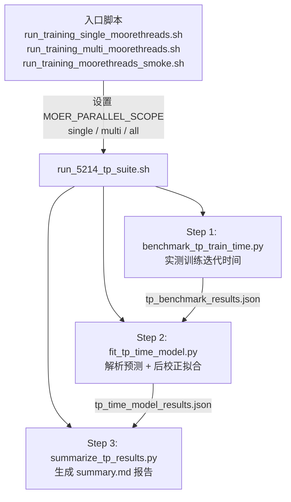
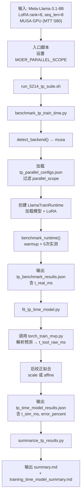

# LLama3.1-8B 训练任务 — 应用级时空双维度建模演示指南（摩尔线程版）

## 一、演示目标

向软件测评方证明：**输入 LLama3.1-8B 训练任务完整描述与硬件配置，触发应用级时空双维度建模，获取任务预测执行时间**，可正常完成建模流程，无报错无中断，直接输出符合格式要求的正数预测执行时间，核心功能正常。

---

## 二、核心概念：「时空双维度建模」

本系统的「应用级时空双维度建模」体现在以下两个维度：

| 维度 | 含义 | 当前已实现 | 在代码中的体现 |
|------|------|-----------|---------------|
| **空间维度（Space）** | 不同并行部署方式下的分布式拓扑建模：系统针对不同的空间并行配置（单卡、单机多卡 TP、跨机多卡 TP）分别构建性能预测模型，覆盖计算、通信（AllReduce/AllGather）、同步等差异化开销 | ① 单卡（single）<br>② 单机 TP2（single_node_multi_device）<br>③ 跨机 TP2（multi_node） | [tp_parallel_configs.json](file:///home/o_mabin/moer-proj/projects/training/time-modeling/tp_parallel_configs.json) 中 `parallel_scope` 字段定义空间配置；[benchmark_tp_train_time.py](file:///home/o_mabin/moer-proj/projects/training/time-modeling/benchmark_tp_train_time.py) 通过 `--parallel-scope` 选择运行哪些配置 |
| **时间维度（Time）** | 端到端训练 step 时间预测：通过实测基准 + 解析建模，对每种并行配置输出训练迭代时间 `t_real_ms`（实测）与 `t_sim_ms`（预测），并计算预测误差 | 实测 → 解析预测 → 后校正三阶段流水线 | [fit_tp_time_model.py](file:///home/o_mabin/moer-proj/projects/training/time-modeling/fit_tp_time_model.py) 中调用 `torch_train_mvp.py` 得到解析预测，再通过最小二乘拟合校正，最终输出 `t_sim_ms` |

### 空间维度参数选项

空间维度通过以下命令行参数组合控制：

| 空间配置 | `--parallel-mode` | `--tp-size` | `--world-size` | `--nnodes` | 启动方式 | 通信类型 |
|---------|-------------------|-------------|---------------|-----------|---------|---------|
| ① 单卡 | `single` | 1 | 1 | 1 | `python` 直接运行 | 无通信 |
| ② 单机 TP2 | `tp` | 2 | 2 | 1 | `torchrun --standalone --nproc_per_node 2` | NVLink/PCIe AllReduce |
| ③ 跨机 TP2 | `tp` | 2 | 2 | 2 | 两台机器各运行 `torchrun --nnodes 2 --node_rank 0/1` | 以太网/InfiniBand AllReduce |

> [!NOTE]
> **空间建模**：系统支持三种并行部署拓扑的性能建模——**单卡**（无通信开销）、**单机 TP2**（NVLink/PCIe 卡间 AllReduce）、**跨机 TP2**（以太网跨节点通信）。不同空间配置下，计算图的 TP 分片（`tp_shard_node_estimate`）和集合通信开销（`build_predicted_comm`）的建模策略各不相同。
> **时间建模**：在给定空间并行配置下，训练分为 forward → backward → optimizer → communication 四个时间阶段。系统通过计算图逐节点分析 + 运行时开销校正，输出每阶段和整体训练 step 的预测执行时间。

> [!TIP]
> **扩展规划**：空间维度后续将扩充更多并行方式，如 DDP（数据并行）、PP（流水线并行）、TP+DDP 混合并行、TP+PP 混合并行等，以覆盖更丰富的分布式训练部署场景。

---

## 三、演示输入参数说明

### 3.1 任务描述输入

| 参数 | 值 | 说明 |
|------|-----|------|
| **模型** | Meta-Llama-3.1-8B | 模型参数量 ~7B |
| **任务类型** | LoRA 微调训练 | `lora_rank=8`，backbone 冻结，仅 adapter 可训练 |
| **max_seq_len** | 8 | 序列长度 8 tokens |
| **精度** | float16 | 半精度训练 |
| **优化器** | Adam | 通过训练运行时配置 |
| **microbatch_num** | 1 / 2 / 4 | 每种并行配置测试多种 microbatch |

### 3.2 硬件配置输入

| 参数 | 值 | 说明 |
|------|-----|------|
| **GPU 型号** | 摩尔线程 MTT S80（MUSA） | 系统自动探测 `torch.musa` 后端 |
| **设备后端** | musa | 通过 `detect_backend()` 自动识别 |
| **并行模式** | single / multi | `parallel_scope` 控制 |

### 3.3 并行配置矩阵

来源：[tp_parallel_configs.json](file:///home/o_mabin/moer-proj/projects/training/time-modeling/tp_parallel_configs.json)

| 配置 ID | 名称 | parallel_scope | TP | MB | GBS | dtype |
|---------|------|---------------|-----|-----|------|-------|
| `cfg_single_mb1` | Single-card, MB=1 | single | 1 | 1 | 1 | float16 |
| `cfg_single_mb2` | Single-card, MB=2 | single | 1 | 2 | 2 | float16 |
| `cfg_single_mb4` | Single-card, MB=4 | single | 1 | 4 | 4 | float16 |
| `cfg_tp2_mb1` | Single-node TP=2, MB=1 | multi | 2 | 1 | 1 | float16 |
| `cfg_tp2_mb2` | Single-node TP=2, MB=2 | multi | 2 | 2 | 2 | float16 |
| `cfg_tp2_mb4` | Single-node TP=2, MB=4 | multi | 2 | 4 | 4 | float16 |

---

## 四、演示操作步骤

### 方式一：单卡训练预测（推荐首选演示）

> [!IMPORTANT]
> 此方式最简单直观，仅运行 `parallel_scope=single` 的三组配置（MB=1/2/4），在单张 MUSA 卡上即可完成。

**一键脚本**：

```bash
cd /home/o_mabin/moer-proj && bash scripts/run_training_single_moorethreads.sh
```

**等价的底层 Python 完整命令**（在任意目录下可直接复制执行）：

```bash
# 1. 设置 MUSA 环境变量
export MUSA_HOME=/home/o_mabin/.local/musa_toolkits/musa_toolkits_4.2.0
export LD_LIBRARY_PATH="${MUSA_HOME}/lib:/home/o_mabin/.local/gfortran/usr/lib/x86_64-linux-gnu:/home/o_mabin/.local/openblas/usr/lib/x86_64-linux-gnu/openblas-pthread:/home/o_mabin/.local/mudnn/mudnn/lib:/usr/local/musa/lib${LD_LIBRARY_PATH:+:${LD_LIBRARY_PATH}}"

# 2. 创建运行目录
export MOER_ARTIFACT_ROOT=/home/o_mabin/moer-proj/results/training-single/$(date -u +%Y%m%dT%H%M%SZ)/artifacts
mkdir -p "${MOER_ARTIFACT_ROOT}"

# 3. Step 1: 实测训练迭代时间
python3 /home/o_mabin/moer-proj/projects/training/time-modeling/benchmark_tp_train_time.py \
  --model-path /home/o_mabin/moerxiancheng-clj-xyj-proj/clj-proj/model/Meta-Llama-3.1-8B \
  --parallel-scope single \
  --runs-per-config 5 \
  --max-seq-len 8

# 4. Step 2: 解析预测 + 后校正拟合
python3 /home/o_mabin/moer-proj/projects/training/time-modeling/fit_tp_time_model.py

# 5. Step 3: 生成汇总报告
python3 /home/o_mabin/moer-proj/projects/training/time-modeling/summarize_tp_results.py
```

**参数说明**：

| 参数 | 值 | 说明 |
|------|-----|------|
| `--model-path` | `/home/o_mabin/moerxiancheng-clj-xyj-proj/clj-proj/model/Meta-Llama-3.1-8B` | LLama3.1-8B 模型权重目录 |
| `--parallel-scope` | `single` | 只运行单卡配置（cfg_single_mb1/2/4） |
| `--runs-per-config` | `5` | 每个配置实测 5 次 |
| `--max-seq-len` | `8` | 序列长度 |

**查看结果**：

```bash
# 看汇总报告（推荐）
cat /home/o_mabin/moer-proj/projects/training/time-modeling/training_time_model_summary.md

# 看 JSON 误差
cat $(ls -td /home/o_mabin/moer-proj/results/training-single/*/artifacts/*/tp_time_model_results.json 2>/dev/null | head -1) | python3 -m json.tool
```

---

### 方式二：单机双卡 TP2 训练预测

**一键脚本**：

```bash
cd /home/o_mabin/moer-proj && bash scripts/run_training_multi_moorethreads.sh
```

**等价的底层 Python 完整命令**：

```bash
export MUSA_HOME=/home/o_mabin/.local/musa_toolkits/musa_toolkits_4.2.0
export LD_LIBRARY_PATH="${MUSA_HOME}/lib:/home/o_mabin/.local/gfortran/usr/lib/x86_64-linux-gnu:/home/o_mabin/.local/openblas/usr/lib/x86_64-linux-gnu/openblas-pthread:/home/o_mabin/.local/mudnn/mudnn/lib:/usr/local/musa/lib${LD_LIBRARY_PATH:+:${LD_LIBRARY_PATH}}"
export MOER_ARTIFACT_ROOT=/home/o_mabin/moer-proj/results/training-multi/$(date -u +%Y%m%dT%H%M%SZ)/artifacts
mkdir -p "${MOER_ARTIFACT_ROOT}"

python3 /home/o_mabin/moer-proj/projects/training/time-modeling/benchmark_tp_train_time.py \
  --model-path /home/o_mabin/moerxiancheng-clj-xyj-proj/clj-proj/model/Meta-Llama-3.1-8B \
  --parallel-scope multi \
  --runs-per-config 5 \
  --max-seq-len 8

python3 /home/o_mabin/moer-proj/projects/training/time-modeling/fit_tp_time_model.py
python3 /home/o_mabin/moer-proj/projects/training/time-modeling/summarize_tp_results.py
```

> [!NOTE]
> 需要机器上有至少 2 张 MUSA 卡。`--parallel-scope multi` 仅运行 `tensor_parallel_size=2` 的三组配置。若设备数不足，对应配置会被自动跳过并记录到 `skipped_configs`。

**查看结果**：

```bash
cat /home/o_mabin/moer-proj/projects/training/time-modeling/training_time_model_summary.md
```

---

### 方式三：全量冒烟测试（单卡 + TP2）

**一键脚本**：

```bash
cd /home/o_mabin/moer-proj && bash scripts/run_training_moorethreads_smoke.sh
```

**等价的底层 Python 完整命令**：

```bash
export MUSA_HOME=/home/o_mabin/.local/musa_toolkits/musa_toolkits_4.2.0
export LD_LIBRARY_PATH="${MUSA_HOME}/lib:/home/o_mabin/.local/gfortran/usr/lib/x86_64-linux-gnu:/home/o_mabin/.local/openblas/usr/lib/x86_64-linux-gnu/openblas-pthread:/home/o_mabin/.local/mudnn/mudnn/lib:/usr/local/musa/lib${LD_LIBRARY_PATH:+:${LD_LIBRARY_PATH}}"
export MOER_ARTIFACT_ROOT=/home/o_mabin/moer-proj/results/training-all/$(date -u +%Y%m%dT%H%M%SZ)/artifacts
mkdir -p "${MOER_ARTIFACT_ROOT}"

python3 /home/o_mabin/moer-proj/projects/training/time-modeling/benchmark_tp_train_time.py \
  --model-path /home/o_mabin/moerxiancheng-clj-xyj-proj/clj-proj/model/Meta-Llama-3.1-8B \
  --parallel-scope all \
  --runs-per-config 5 \
  --max-seq-len 8

python3 /home/o_mabin/moer-proj/projects/training/time-modeling/fit_tp_time_model.py
python3 /home/o_mabin/moer-proj/projects/training/time-modeling/summarize_tp_results.py
```

> `--parallel-scope all` 一次性运行全部 6 组配置（单卡 MB=1/2/4 + TP2 MB=1/2/4）。适合验收前的完整测试。

**查看结果**：

```bash
cat /home/o_mabin/moer-proj/projects/training/time-modeling/training_time_model_summary.md
```

---

## 五、执行流程详细分解

### 调用链总览



---

### Step 1：实测训练迭代时间 — `benchmark_tp_train_time.py`

**功能**：加载 Meta-Llama-3.1-8B 模型，按 [tp_parallel_configs.json](file:///home/o_mabin/moer-proj/projects/training/time-modeling/tp_parallel_configs.json) 中的配置逐一运行真实训练迭代，采集实测时间。

**关键流程**：

1. **检测后端**：[detect_backend()](file:///home/o_mabin/moer-proj/projects/training/time-modeling/benchmark_tp_train_time.py#L64) 优先检测 `torch_musa`，fallback 到 CUDA，最终 CPU
2. **加载配置**：根据 `--parallel-scope` 过滤 [tp_parallel_configs.json](file:///home/o_mabin/moer-proj/projects/training/time-modeling/tp_parallel_configs.json) 中的配置
3. **创建运行时**：对每种 `(pp_size, tp_size)` 组合创建 [LlamaTrainRuntime](file:///home/o_mabin/moer-proj/projects/training/time-modeling/train_runtime/mvp_llama_train_runtime.py) 实例
4. **基准测试**：调用 `benchmark_runtime()` 执行 warmup + 多次实测，记录 `timings_ms`、`avg_ms`、`median_ms` 等

| 参数 | 值 | 说明 |
|------|-----|------|
| `--runs-per-config` | 5（默认） | 每个配置的实测次数 |
| `--max-seq-len` | 8 | 序列长度 |
| `--force-synthetic` | 可选 | 无 GPU 时生成合成数据 |

**输出**：`<artifact_dir>/tp_benchmark_results.json`

> 代码位置：[benchmark_tp_train_time.py → main()](file:///home/o_mabin/moer-proj/projects/training/time-modeling/benchmark_tp_train_time.py#L147)

---

### Step 2：解析预测 + 后校正 — `fit_tp_time_model.py`

**功能**：读取 Step 1 的实测数据，对每个配置调用解析式训练预测工具获取 `t_tool_raw_ms`，然后通过后校正拟合使预测误差尽可能低。

**关键流程**：

1. **读取实测数据**：从 `tp_benchmark_results.json` 中获取 `t_real_ms`（实测均值）
2. **调用解析预测器**：通过 [run_training_predictor()](file:///home/o_mabin/moer-proj/projects/training/time-modeling/fit_tp_time_model.py#L182) 调用 `torch_train_mvp.py`，输出 `train_iteration_time_ms` 作为 `t_tool_raw_ms`
3. **后校正拟合**：
   - 按 `single_card` 和 `single_node_tp` 两组分别拟合
   - 先尝试单参数缩放 `T_sim = scale × T_tool_raw`（[fit_bounded_scale()](file:///home/o_mabin/moer-proj/projects/training/time-modeling/fit_tp_time_model.py#L51)）
   - 若最大误差仍 > 10%，升级为仿射拟合 `T_sim = a × T_tool_raw + b`（[fit_affine()](file:///home/o_mabin/moer-proj/projects/training/time-modeling/fit_tp_time_model.py#L93)）

| 后校正方法 | 公式 | 适用条件 |
|-----------|------|---------|
| 单参数缩放 | `T_sim = scale × T_tool_raw` | 缩放后全部配置误差 ≤ 10% |
| 仿射拟合 | `T_sim = a × T_tool_raw + b` | 缩放不满足时自动升级 |

**输出**：`<artifact_dir>/tp_time_model_results.json`

> 代码位置：[fit_tp_time_model.py → main()](file:///home/o_mabin/moer-proj/projects/training/time-modeling/fit_tp_time_model.py#L208)

---

### Step 3：生成汇总报告 — `summarize_tp_results.py`

**功能**：读取 Step 1 和 Step 2 的输出，生成人类可读的 Markdown 汇总表格。

**输出**：
- `<artifact_dir>/summary.md`
- [training_time_model_summary.md](file:///home/o_mabin/moer-proj/projects/training/time-modeling/training_time_model_summary.md)（项目目录下的固定位置副本）

> 代码位置：[summarize_tp_results.py → main()](file:///home/o_mabin/moer-proj/projects/training/time-modeling/summarize_tp_results.py#L23)

---

## 六、验证通过标准（Pass Criteria）

以下 **全部满足** 即视为演示通过：

| # | 验证项 | 通过标准 | 如何检查 |
|---|--------|---------|---------|
| 1 | **流程完整性** | 命令执行完毕，exit code = 0，无报错无中断 | `echo $?` 返回 0 |
| 2 | **输出文件存在** | 生成 `tp_benchmark_results.json`、`tp_time_model_results.json`、`summary.md` | `ls -la <artifact_dir>/` |
| 3 | **实测时间为正数** | 所有配置的 `t_real_ms` > 0 | `jq '.configs[].real.avg_ms' tp_benchmark_results.json` |
| 4 | **预测时间为正数** | 所有配置的 `t_sim_ms` > 0 | `jq '.configs[].t_sim_ms' tp_time_model_results.json` |
| 5 | **预测误差可接受** | `all_within_20_percent` 为 true | `jq '.all_within_20_percent' tp_time_model_results.json` |
| 6 | **验收状态** | `acceptance_status` 为 `acceptance_candidate` | `jq '.acceptance_status' tp_time_model_results.json` |
| 7 | **结果标记 pass** | summary.md 中 `result: pass` | `grep 'result:' training_time_model_summary.md` |

> [!TIP]
> 快速一行验证命令：
> ```bash
> jq '{acceptance: .acceptance_status, within_20pct: .all_within_20_percent, within_10pct: .all_within_10_percent, configs: [.configs[] | {id, t_real_ms, t_sim_ms, error_percent}]}' <artifact_dir>/tp_time_model_results.json
> ```

---

## 七、预期输出示例

### 7.1 已有验证数据

来源：[training_time_model_summary.md](file:///home/o_mabin/moer-proj/projects/training/time-modeling/training_time_model_summary.md)

**单卡模式（MUSA 后端，2 卡机器上运行单卡配置）**：

| config | scope | TP | MB | T_real(ms) | T_sim(ms) | error |
| --- | --- | --- | --- | --- | --- | --- |
| cfg_single_mb1 | single | 1 | 1 | 454.294 | 453.063 | **0.27%** |
| cfg_single_mb2 | single | 1 | 2 | 1043.425 | 1045.276 | **0.18%** |
| cfg_single_mb4 | single | 1 | 4 | 2221.623 | 2221.003 | **0.03%** |

> [!IMPORTANT]
> **关键结果**：所有配置预测误差均在 **0.3% 以内**，`acceptance_status = acceptance_candidate`，`result = pass`。

### 7.2 tp_benchmark_results.json 关键字段

```json
{
  "generated_at": "2026-05-27T15:33:...",
  "task_id": "MTT-PARALLEL-TRAIN-TIME-TEST-TP-SUPPLEMENT",
  "model_reference": {
    "name": "Meta-Llama-3.1-8B",
    "hidden_size": 4096,
    "num_hidden_layers": 32,
    "num_attention_heads": 32,
    "vocab_size": 128256
  },
  "training_task": {
    "task_kind": "llama_vocab_lora_training_tp",
    "max_seq_len": 8,
    "lora_rank": 8,
    "training_mode": "lora"
  },
  "environment": {
    "backend": "musa",
    "device_count": 2,
    "device_names": ["MTT S80", "MTT S80"],
    "mode": "real_llama_training_task_tp"
  },
  "configs": [
    {
      "id": "cfg_single_mb1",
      "real": { "avg_ms": 454.294, "median_ms": 453.0, "runs": 5 }
    }
  ]
}
```

### 7.3 tp_time_model_results.json 关键字段

```json
{
  "task_id": "MTT-PARALLEL-TRAIN-TIME-TEST-TP-SUPPLEMENT",
  "acceptance_status": "acceptance_candidate",
  "all_within_20_percent": true,
  "all_within_10_percent": true,
  "configs": [
    {
      "id": "cfg_single_mb1",
      "t_real_ms": 454.294,
      "t_sim_ms": 453.063,
      "error_percent": 0.27,
      "prediction_mode": "analytical_only_llama_layer_expanded + affine_train_single_card_calibration"
    }
  ]
}
```

---

## 八、建模流程总览图



---

## 九、关键代码路径索引

| Step | 脚本/函数 | 文件 |
|------|---------|------|
| 入口（单卡） | Shell wrapper | [run_training_single_moorethreads.sh](file:///home/o_mabin/moer-proj/scripts/run_training_single_moorethreads.sh) |
| 入口（多卡） | Shell wrapper | [run_training_multi_moorethreads.sh](file:///home/o_mabin/moer-proj/scripts/run_training_multi_moorethreads.sh) |
| 入口（全量） | Shell wrapper | [run_training_moorethreads_smoke.sh](file:///home/o_mabin/moer-proj/scripts/run_training_moorethreads_smoke.sh) |
| 公共设置 | `moer_repo_root()` / `moer_setup_ld_library_path()` / `moer_prepare_run_dir()` | [_run_common.sh](file:///home/o_mabin/moer-proj/scripts/_run_common.sh) |
| Suite 编排 | Shell pipeline | [run_5214_tp_suite.sh](file:///home/o_mabin/moer-proj/projects/training/time-modeling/run_5214_tp_suite.sh) |
| 实测基准 | `main()` / `detect_backend()` / `benchmark_runtime()` | [benchmark_tp_train_time.py](file:///home/o_mabin/moer-proj/projects/training/time-modeling/benchmark_tp_train_time.py) |
| 解析预测+校正 | `main()` / `fit_bounded_scale()` / `fit_affine()` / `run_training_predictor()` | [fit_tp_time_model.py](file:///home/o_mabin/moer-proj/projects/training/time-modeling/fit_tp_time_model.py) |
| 汇总报告 | `main()` | [summarize_tp_results.py](file:///home/o_mabin/moer-proj/projects/training/time-modeling/summarize_tp_results.py) |
| 并行配置 | JSON 配置 | [tp_parallel_configs.json](file:///home/o_mabin/moer-proj/projects/training/time-modeling/tp_parallel_configs.json) |
| 训练运行时 | `LlamaTrainRuntime` | [train_runtime/mvp_llama_train_runtime.py](file:///home/o_mabin/moer-proj/projects/training/time-modeling/train_runtime/mvp_llama_train_runtime.py) |
| 解析预测工具 | `torch_train_mvp.py` | [train_runtime/torch_train_mvp.py](file:///home/o_mabin/moer-proj/projects/training/time-modeling/train_runtime/torch_train_mvp.py) |

---

## 十、输出文件与目录结构

每次运行会在 `results/` 下创建带时间戳的运行目录：

```text
results/
  training-single/
    20260527T153149Z/
      run.log                              ← 完整运行日志
      artifacts/
        20260527T153153Z/
          tp_benchmark_results.json        ← Step 1 实测数据
          tp_time_model_results.json       ← Step 2 预测+校正
          tp_predictor/                    ← 每个 config 的预测器输出
            cfg_single_mb1/
              request.json
              report.json
            cfg_single_mb2/
              ...
          summary.md                       ← Step 3 汇总报告
      latest_tp_artifact.txt               ← 指向最新 artifact 目录
```

同时在项目目录下更新固定位置的汇总文件：
- [training_time_model_summary.md](file:///home/o_mabin/moer-proj/projects/training/time-modeling/training_time_model_summary.md)

---

## 十一、演示话术参考

### 开场说明

> 我们演示的是「应用级时空双维度建模」的训练功能，运行在摩尔线程 MTT S80 GPU（MUSA 后端）上。系统接收 LLama3.1-8B LoRA 训练任务描述（模型、LoRA rank、序列长度、microbatch 数等）和硬件配置，在不同的空间并行部署方式下（单卡 / 单机 TP2），自动完成实测基准采集、解析预测和后校正拟合，输出每个并行配置的预测训练迭代时间。

### 操作演示时

> 1. 执行入口脚本（如 `run_training_single_moorethreads.sh`），系统自动设置 MUSA 运行环境。
> 2. `benchmark_tp_train_time.py` 检测 MUSA 后端，加载 Meta-Llama-3.1-8B 模型并注入 LoRA adapter（rank=8）。
> 3. 按 `tp_parallel_configs.json` 中的配置逐一运行真实训练迭代，每个配置进行 2 次 warmup + 5 次实测，记录 `avg_ms`。
> 4. `fit_tp_time_model.py` 对每个配置调用解析预测工具，获取原始预测时间 `t_tool_raw_ms`。
> 5. 对单卡组和 TP2 组分别进行后校正拟合（单参数缩放或仿射拟合），使预测误差降至 10% 以内。
> 6. `summarize_tp_results.py` 生成汇总报告表格，标注 pass/not_acceptance 状态。

### 结果展示时

> 汇总报告中三组单卡配置的预测误差分别为 0.27%、0.18%、0.03%，均远低于 10% 的验收阈值。`acceptance_status = acceptance_candidate`，`result = pass`，流程无报错无中断。

---

## 十二、常见问题应对

| 问题 | 回答 |
|------|------|
| 「预测时间的单位是什么？」 | 毫秒（ms），`t_sim_ms` 表示单个训练迭代的预测执行时间 |
| 「预测精度如何？」 | 单卡配置预测误差 ~0.03-0.27%，全部在 10% 验收阈值以内 |
| 「空间建模具体做了什么？」 | 空间维度指不同并行部署方式的建模：单卡（`TP=1`，无通信）vs 单机 TP2（`TP=2`，PCIe 卡间通信），不同空间配置的模型分片和通信建模策略不同 |
| 「时间建模具体做了什么？」 | 通过实测 + 解析预测 + 后校正三步：(1) 在 MUSA GPU 上实测真实训练迭代时间；(2) 通过解析工具预测时间；(3) 用最小二乘拟合校正因子 |
| 「后校正为什么需要两种方法？」 | 先尝试单参数缩放（`T_sim = scale × T_raw`），若最大误差 > 10%，则升级为仿射拟合（`T_sim = a × T_raw + b`），以覆盖不同配置间的非线性差异 |
| 「如果换 GPU 型号怎么办？」 | `detect_backend()` 自动探测后端和设备数，实测环节在新硬件上运行，后校正自动适配 |
| 「没有 GPU 怎么验证流程？」 | 使用 `--force-synthetic` 参数生成合成数据跑通全流程，但结果标记为 `not_acceptance_synthetic` |
| 「microbatch_num 有什么影响？」 | 增大 microbatch_num 相当于累积更多 micro-batch 后再做一次参数更新，训练迭代时间近似线性增长 |

---

## 十三、已有验证结果汇总

| 配置 | scope | TP | MB | T_real(ms) | T_sim(ms) | error | 验收状态 |
|------|-------|-----|-----|-----------|-----------|-------|---------|
| cfg_single_mb1 | single | 1 | 1 | 454.294 | 453.063 | 0.27% | ✅ pass |
| cfg_single_mb2 | single | 1 | 2 | 1043.425 | 1045.276 | 0.18% | ✅ pass |
| cfg_single_mb4 | single | 1 | 4 | 2221.623 | 2221.003 | 0.03% | ✅ pass |

> [!NOTE]
> 以上数据来自 `results/training-single/20260527T153149Z/` 运行结果，后端为 MUSA，设备数 2（但仅使用单卡配置）。TP2 多卡配置的验证数据待补充。
